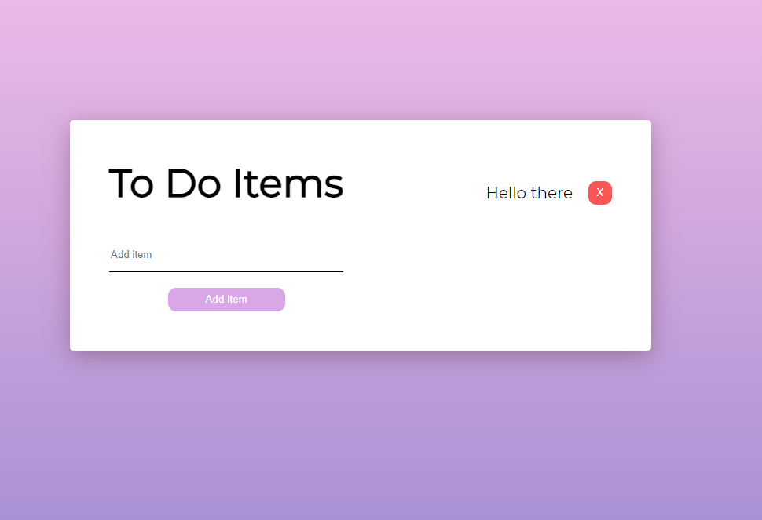

<h1 align="center">CRUD - todo</h1>

  

## Project Overview 🎉
A todo CRUD application that stores items in local memory. Written in react and styled in CSS.

## Tech/framework used 🔧

| Tech                                                    | Description                              |
| ------------------------------------------------------- | ---------------------------------------- |
| [React]()                           | Used to build the site   |
| [CSS](X)                           | Used to stylize the application|

## Installation 💾
Clone this repo to your desktop and run  `npm install`  to install all the dependencies.
Once the dependencies are installed, you can run  `npm start`  to start the application. You will then be able to access it at http://localhost:3000
## Available scripts

| Command                   | Description                   |     |
| ------------------------- | ----------------------------- | --- |
| `npm start`           | Open local server             |     |
| `npm build`             | Create optimized build        |     |
| `npm test`             | Run tests        |     |

## Live 📍
https://miedzinskijakub.github.io/CRUD-todo/
